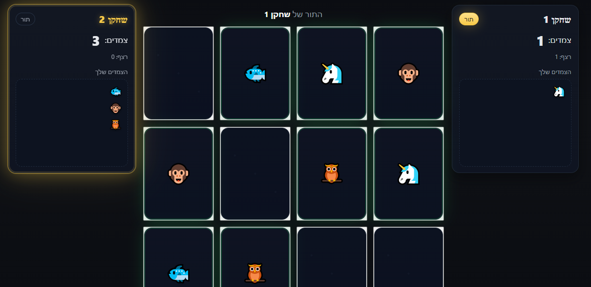

------------------------------------------------------------------------
🐾 משחק הזיכרון - חיות

🎮 תיאור

משחק זיכרון מהנה לשני שחקנים עם קלפי חיות חמודות. מטרת המשחק היא למצוא כמה שיותר צמדים תואמים.
בכל תור, שחקן הופך שני קלפים:

אם נמצא צמד — הוא מקבל נקודה וזוכה לעוד תור.

אם לא — התור עובר לשחקן השני.
המנצח הוא זה שצובר הכי הרבה צמדים!

✨ פיצ'רים

🎭 אנימציית הפיכת קלפים

🔥 אפקט אש כאשר יש רצף של 3+ צמדים

👑 הבלטת המוביל עם אפקט זהב במסך גדול

🐶 רשימת אימוג'ים של הצמדים שנמצאו

🎉 מסך סיום עם הכרזת מנצח

📝 אפשרות להזין שמות שחקנים בהתאמה אישית

🛠️ טכנולוגיות :

HTML5 — מבנה בסיסי של המשחק
CSS — עיצוב מודרני כהה עם אנימציות
JavaScript (Vanilla) — לוגיקת המשחק וניהול תורות

🚀 התקנה והרצה

הורד את הקבצים למחשב שלך.

פתח את הקובץ index.html בדפדפן.

תהנה לשחק! 🎮

📸 צילום מסך 

  

👨‍💻 פיתוח

נבנה במסגרת לימודי פיתוח אתרים לשילוב:

חוויית משתמש אינטראקטיבית

עיצוב מושך עין

חיזוק מיומנויות HTML, CSS ו-JS

⚖️ רישיון

פרויקט זה פתוח לשימוש חופשי לצורכי למידה ותרגול.

------------------------------------------------------------------------

Memory Game — Animals 🐾

Description

A fun memory card game for two players with cute animal emojis. The goal is to collect as many matching pairs as possible.
On each turn, a player flips two cards:

If they match — the player scores a point and gets another turn.

If not — the turn switches to the other player.
The winner is the one with the most pairs!

Features✨

🎭 Card flip animations 

🔥 Fire effect for streaks of 3+ matches 

👑 Highlight the leader with a golden glow on desktop 

🐶 Emoji list of collected pairs

🎉 End screen with winner announcement

📝 Custom player name selection

🛠️ Built With :

HTML5 — Game structure
CSS — Modern dark design with animations
JavaScript (Vanilla) Game logic and turn management

🚀 Installation & Run

Download the project files to your computer.

Open index.html in your browser.

Enjoy playing! 🎮

Screenshot 📸

  

Development 👨‍💻

Built as part of Web Development learning, combining:

Interactive user experience
Eye-catching design
Strengthening HTML, CSS & JS skills

⚖️ License
This project is free to use for learning and practice purposes.

------------------------------------------------------------------------
